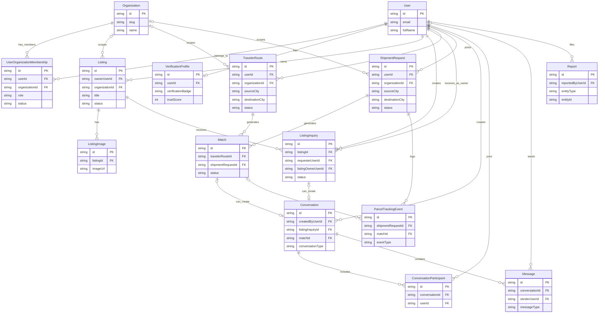

# Trusted Network Entity Relationship Diagram

This diagram is derived from the current MVP Prisma schema:

- [backend/prisma/schema.prisma](../backend/prisma/schema.prisma)

Use it as the visual reference while implementing services, repositories, and API contracts.

## Mermaid ER diagram

## Reading the diagram by domain

### Trust layer

- `User`
- `Organization`
- `UserOrganizationMembership`
- `VerificationProfile`

This is the foundation for a trusted network boundary.

### Tenant replacement

- `Listing`
- `ListingImage`
- `ListingInquiry`

Listings belong to a user and may optionally belong to an organization. Inquiries connect interested users to listings.

### Send Item

- `TravelerRoute`
- `ShipmentRequest`
- `Match`

Routes and requests stay explicit, and `Match` represents the connection between them.

### Communication

- `Conversation`
- `ConversationParticipant`
- `Message`

Conversation can be attached to either a `ListingInquiry` or a `Match`, which is why chat remains usable across both product flows.

### Trust and safety

- `Report`
- `ParcelTrackingEvent`

`Report` supports moderation. `ParcelTrackingEvent` supports the future delivery-tracking timeline.

## Important design note

The current schema intentionally avoids over-generic polymorphism for the MVP.

That means:

- tenant relationships are explicit
- shipment relationships are explicit
- chat attaches to real domain records

This is better for developer readability and safer backend implementation in the early stages.
